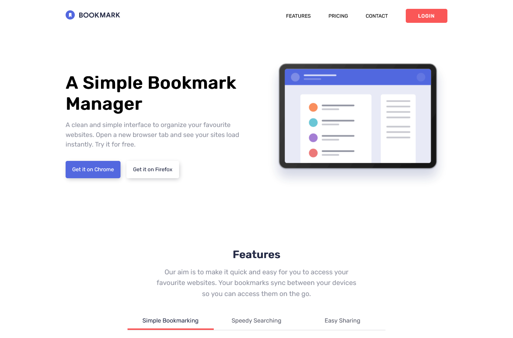

# Frontend Mentor - Bookmark landing page solution

This is a solution to the [Bookmark landing page challenge on Frontend Mentor](https://www.frontendmentor.io/challenges/bookmark-landing-page-5d0b588a9edda32581d29158)

## Table of contents

- [Overview](#overview)
  - [The challenge](#the-challenge)
  - [Screenshot](#screenshot)
  - [Links](#links)
- [My process](#my-process)
  - [Built with](#built-with)
  - [What I learned](#what-i-learned)
- [Author](#author)

## Overview

### The challenge

Users should be able to:

- View the optimal layout for the site depending on their device's screen size
- See hover states for all interactive elements on the page
- Receive an error message when the newsletter form is submitted if:
  - The input field is empty
  - The email address is not formatted correctly

### Screenshot



### Links

- Solution URL: [Add solution URL here](https://your-solution-url.com)
- Live Site URL: [Add live site URL here](https://your-live-site-url.com)

## My process

### Built with

- Semantic HTML5 markup
- Flexbox
- Mobile-first workflow
- JQuery
- Sass

### What I learned

I learned a lot about JQuery - selecting DOM, each function, find funtion and more. I also learnead very usefull features that Sass offers. I am also really proud of my BEM technique improvement.

```css
@mixin light-btn {
	@extend %btn;
	background: white;
	color: $dark;

	&:hover {
		border: 2px solid $dark;
	}
}
```

```js
$(".faq__accordion-header").each(function () {
	$(this).on("click", () => {
		$(".faq__accordion-content").each(function () {
			$(this).removeClass("faq__accordion-content--active");
		});
		$(".faq__accordion-btn").each(function () {
			$(this).removeClass("faq__accordion-btn--active");
		});
		$(this)
			.parent()
			.find(".faq__accordion-content")
			.addClass("faq__accordion-content--active");

		$(this)
			.parent()
			.find(".faq__accordion-btn")
			.addClass("faq__accordion-btn--active");
	});
});
```

## Author

- Website - [kozlicki.com](https://www.kozlicki.com)
- Frontend Mentor - [@fkozlicki](https://www.frontendmentor.io/profile/fkozlicki)
- Twitter - [@FKozlicki](https://twitter.com/FKozlicki)
